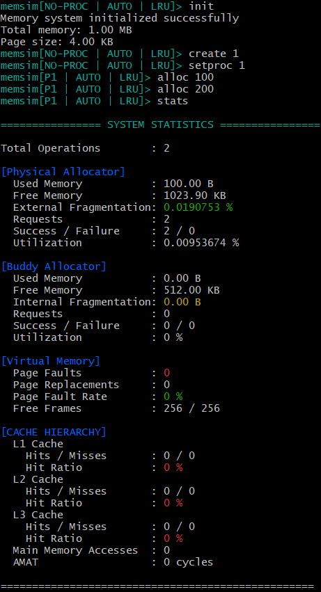
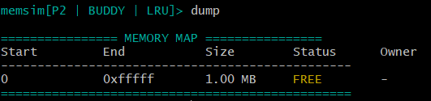
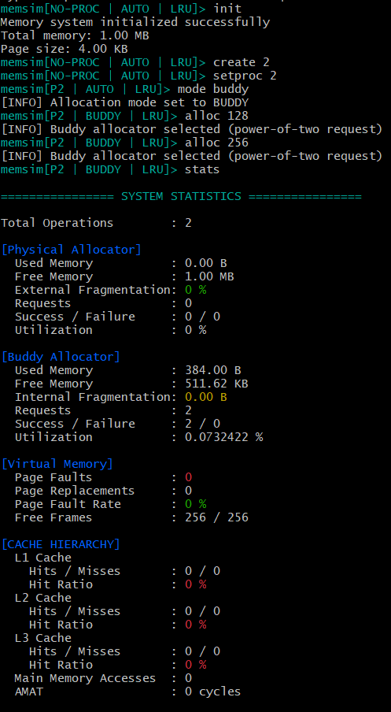
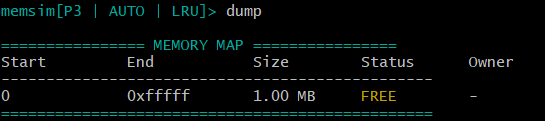
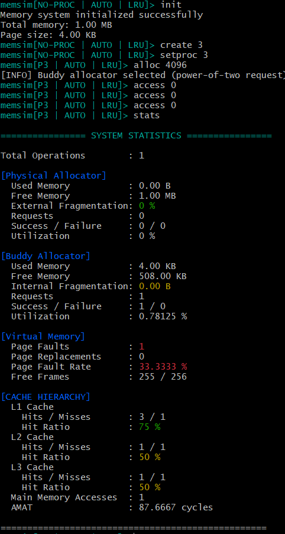

#  Memory Management Simulator (C++)


**CLI-based Operating Systems memory management simulator** that models how modern OSes handle **physical memory allocation, virtual memory, and cache hierarchy**, with real-time statistics and visualization.

This project focuses on **systems-level design**, **algorithmic correctness**, and **performance trade-offs** in memory management.

---

##  Objectives

- Simulate dynamic memory allocation and deallocation
- Implement multiple allocation strategies
- Model multilevel CPU cache hierarchies
- Implement paging-based virtual memory
- Observe fragmentation, cache behavior, and page faults

---

##  Key Features

##  Physical Memory Management

- Simulates a contiguous block of physical memory
- Dynamic allocation and deallocation
- Allocation strategies:
  - First Fit
  - Best Fit
  - Worst Fit
- Correct block splitting and coalescing
- Tracks:
  - Used / free memory
  - External fragmentation
  - Allocation success / failure
  - Memory utilization

---

##  Buddy Memory Allocator

- Power-of-two memory management
- Allocation size rounded to nearest power of two
- Recursive block splitting
- Buddy coalescing on deallocation
- Tracks:
  - Internal fragmentation
  - Allocation statistics
  - Memory utilization

---

##  Allocation Modes

- `AUTO` — Power-of-two requests routed to Buddy allocator
- `PHYSICAL` — Always use physical allocator
- `BUDDY` — Always use buddy allocator
- `FORCED` — Explicit override mode

---

##  Virtual Memory Simulation

- Paging-based virtual memory
- Per-process page tables
- Virtual → Physical address translation
- Page replacement policies:
  - FIFO
  - LRU
  - CLOCK
- Tracks:
  - Page faults
  - Page replacements
  - Page fault rate
  - Free / total frames

---

##  Cache Hierarchy Simulation

- Multi-level cache hierarchy:
  - L1 Cache
  - L2 Cache
  - L3 Cache
- Configurable cache size, line size, and associativity
- Replacement policies:
  - FIFO
  - LRU
- Memory access flow:

Virtual Address
  → Page Table
  → Physical Address
  → L1 → L2 → L3 → Main Memory


### Statistics Tracked (Cache)

- Cache hits and misses per level
- Hit ratios
- Main memory accesses
- Average Memory Access Time (AMAT)


## Command Line Interface (CLI)

The simulator provides an interactive command-line interface to control all components of the memory system.

### Example Usage

```bash
memsim> init
memsim> create 1
memsim> setproc 1
memsim[P1 | AUTO | LRU]> alloc 4KB
memsim[P1 | AUTO | LRU]> access 0
memsim> stats
```

### Supported Commands

#### System
- `init` — Initialize the memory system
- `quit` — Exit the simulator
- `help` — Display all available commands

#### Process Management
- `create <pid>` — Create a new process
- `setproc <pid>` — Set current process context
- `terminate <pid>` — Terminate a process
- `process [pid]` — Display process information

#### Memory Allocation
- `alloc <size>` — Allocate memory (supports B / KB / MB)
- `free <pid> <address>` — Free allocated memory
- `mode <auto|buddy|physical|forced>` — Set allocation mode
- `strategy <first|best|worst>` — Set physical allocation strategy

#### Virtual Memory
- `access <address> [write]` — Access virtual memory
- `policy <fifo|lru|clock>` — Set page replacement policy

#### Inspection & Testing
- `dump` — Dump physical memory layout
- `stats` — Show system statistics
- `bench [alloc|cache]` — Run benchmarks
- `test [name]` — Run predefined memory tests

#### UI / UX
- `color <on|off>` — Toggle colored output

---

## Build & Run Instructions

### Prerequisites
- C++17 compatible compiler
- CMake
- Ninja (recommended)

### Build Steps

```bash
mkdir build
cd build
cmake ..
ninja
./memory-simulator
```

---

## Project Structure

```
memory-simulator/
├── src/
│   ├── allocator/
│   ├── buddy/
│   ├── cache/
│   ├── virtual_memory/
│   ├── cli/
│   └── main.cpp
├── include/
├── tests/
├── docs/
├── CMakeLists.txt
└── README.md
```

---
## 📸 Demonstration

### Allocation & Fragmentation

#### Memory Layout (Dump)


#### Allocation Statistics


---

### Buddy Allocator

#### Buddy Memory Layout


#### Buddy Allocator Statistics


---

### Cache & Virtual Memory

#### Cache + Virtual Memory Access Flow


#### Cache & VM Statistics



## Design Highlights

- Clean separation between allocators, cache, and virtual memory
- Modular and extensible architecture
- Accurate modeling of OS memory-management behavior
- Emphasis on correctness and performance trade-offs

---

## Limitations

- No real disk I/O (page faults are symbolic)
- Single-threaded simulation
- Timing values are relative, not hardware-accurate


